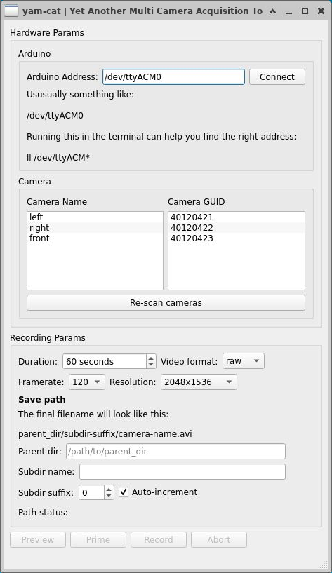

# yam-cat
**Y**et **A**nother **M**ulti **C**amera **A**cquisition **T**ool

[](https://yamcat.readthedocs.io/en/latest/?badge=latest)

A multi-camera synchronized acquisition tool that I wrote during my rotation in the Scherrer Lab at UNC Chapel Hill.

The current master branch is designed to work with "The Imaging Source" cameras. See the November 2021 commits for a version that works with Basler cameras. To run the GUI just execute `yam-cat/yamcat` with python. To use the backend directly see `yam-cat/yamcat/test_operator.py`.

Docs: https://yamcat.readthedocs.io/en/latest/



# Installation

Make sure you have build tools, openblas etc.

```
sudo apt update
sudo apt install build-essential git python3-dev python3-venv python3-pip
sudo apt install libopenblas*
# these are needed for tiscamera
sudo apt-get install libcairo2-dev libjpeg-dev libgif-dev 
```

Create an environment for yamcat
```
# create a dir for venvs if it doesn't already exist
mkdir ~/python-venvs
mkdir ~/repos
python3 -m venv ~/python-venvs/yamcat
source ~/python-venvs/yamcat/bin/activate
cd ~/repos
git clone https://github.com/ScherrerLab/yam-cat.git
cd ./yam-cat
pip install -r requirements.txt
```


**While still in the yamcat venv** compile tiscamera from kushal's fork (it's modified to work on ubuntu 21.04)

```
cd ~/repos
git clone https://github.com/kushalkolar/tiscamera.git
cd tiscamera
./scripts/dependency-manager install
sudo ./scripts/install-dependencies.sh --compilation --runtime
mkdir build
cd build/
cmake -DBUILD_ARAVIS=OFF ..
make -j14
sudo make install
```

Install some more stuff

```
pip install PyGObject
pip install pycairo
pip install --upgrade pip setuptools wheel
pip install p5py
pip install PEP517
pip install git+https://github.com/pygobject/pycairo.git
pip install PyGObject
```

Check that tcam-capture works

```
tcam-capture
```
