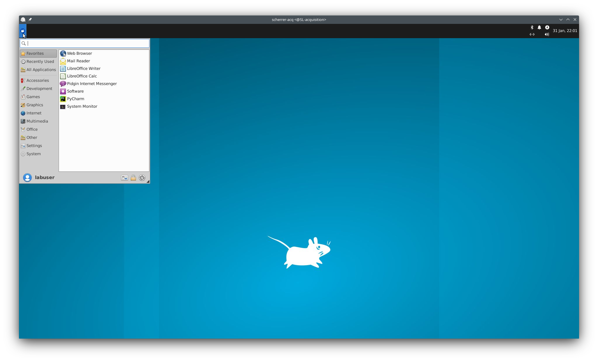

GUI Usage
*********

Video
=====

.. raw:: html

    <iframe width="560" height="315" src="https://www.youtube.com/embed/qgNg3yVzkMY" title="YouTube video player" frameborder="0" allow="accelerometer; autoplay; clipboard-write; encrypted-media; gyroscope; picture-in-picture" allowfullscreen></iframe>

Launch yamcat
=============

After logging in, press ``Ctrl + Alt + T`` on your keyboard to bring up a terminal. You can also use the application menu in the top left corner of the screen (looks like a mouse face) and click on the terminal in the favorites to type in "terminal"

First activate the ``yamcat`` virtual environment. You can do this by just entering ``ae_yamcat``. You can also just type in ``ae_`` and press "Page Up" on your keyboard to scroll through the history until ``ae_yamcat`` comes up.

Next, launch ``yamcat`` by entering ``python ~/repos/yam-cat/yamcat``. Similar to above, you can just start typing in "py" and then press "Page Up" to scroll through your history until it comes up.

The ``yamcatt`` GUI should launch. Ignore any ``at.qpa.xcb`` errors (you probably won't see this, if working with the computer on-site. I made this tutorial remotely)

Connect Arduino
===============

The first thing to do in the GUI is connect to the Arduino. The default arduino address from the ``config.yaml`` file is ``/dev/ttyACM0`` and will already be entered. Click **Connect**. *It will always take a few seconds to connect to the arduino**.

Sometimes, for weird reasons, the address may change to something like ``/dev/ttyACM1``. The instructions in the GUI will help you find the right address if you're unable to connect.

If the arduino connects successively, you will see a message ``** Yay Arduino is connected! **``

Recording Params
================

Now that the arduino is connected you can set the recording params.

- **Duration:** At the moment this param is not used. You must end the recording by pressing the **Abort** button.
- **Video format:** For now please keep this as ``raw``. When you concat the videos from the multiple views into a single video they will be compressed anyways.
- **Framerate:** For now please use 30fps for 4 cameras. The USB bus cannot handle 4 cams @60Hz. We are buying a new PCIe USB card for this.
- **Resolution:** Use the highest one for now

**Save path**

The instructions here describe how these params work, briefly:

- **Parent dir:** used for something like an experiment name.
- **Subdir name** useful for something like "mouse"
- **Subdir suffix:** is a suffix that is appended to the **Subdir name**. If **Auto-increment** is checked the **Subdir suffix** will increment by ``1`` after each recording. This is useful for going through your mice one after another.

The **Path status** is constantly examining each of these entered parameters to verify that you are not overwriting existing videos, i.e. to make sure that the combination of these does not already exist.

.. warning:: It does not currently check whether or not you have permissions to the parent directory. This would happen if you mispelled ``/home/labuser``. The parent directory *must* be under ``/home/labuser``

So basically the final path will look like::

    /home/labuser/parent_dir/subdir-suffix-num

Example resultant directory if **Parent dir** is set to ``/home/labuser/my_experiment_name``, **Subdir** is set to ``mouse`` and **suffix** is set to ``1``.::

    /home/labuser/my_experiment_name/mouse-1

Video files correponding to each "Camera name" will be found within the above directory.

Prime
=====

Now you can **"Prime"** the cameras for recording. This sets up the camera processes so that they're ready to start acquiring frames as soon as the trigger starts. *This will take a 2-3 seconds after you click the button*.

*You can prepare the mouse, but don't place it in the field of view just yet.*

.. warning:: **De-Prime** is currently not implemented, please don't click it. If you do accidentaly click it, just close and re-launch ``yamcat``.

Once the cameras are primed you will see the message ``**Cameras Primed**``. You will also find empty files for each of the camera views at the **Save path** which you have set. Sometimes these files are 0 bytes, sometimes they are a large random number of bytes. As far as I know it doesn't matter, they are still empty files until you start recording.

Record
======

Since the cameras are now primed you can click "Record" to start the trigger. Once you see the message ``Started Trigge`` (usually instant) it means that frames are being grabbed.

*You may now put your mouse in field of view.*

You will see that the file sizes grow as frames are grabbed and dumped to disk.

To end the recording, click the **Abort** button. You will see messaging stating the the ``Recording finished``.

.. warning:: **DO NOT CLICK THE PRIME BUTTON UNTIL YOU SEE THAT THE ARDUINO HAS RE-CONNECTED!!** I will figure out how to make the button un-clickable during this stage. But you're generally cleaning the apparatus, dealing with mice etc. during this time so there is no need to **Prime** the next recording immediately.

Once the aruduino has re-connected you're ready to **Prime** for the next recording. If you have set the **Auto-increment** checkbox, you should notice that the **Subdir suffix** has incremented by 1.

